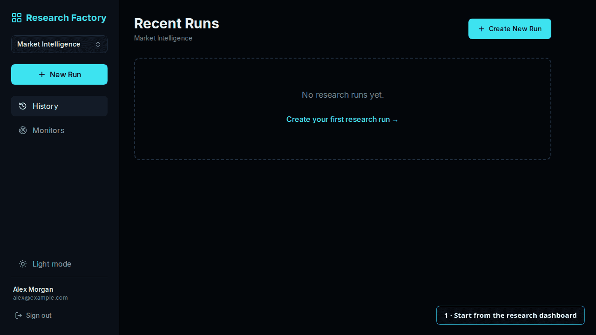
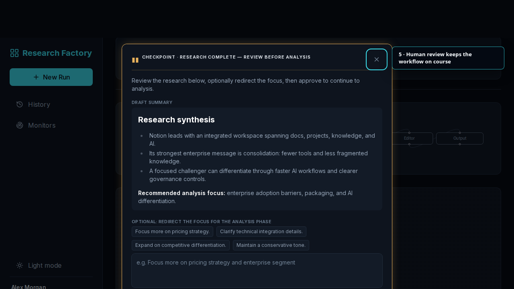
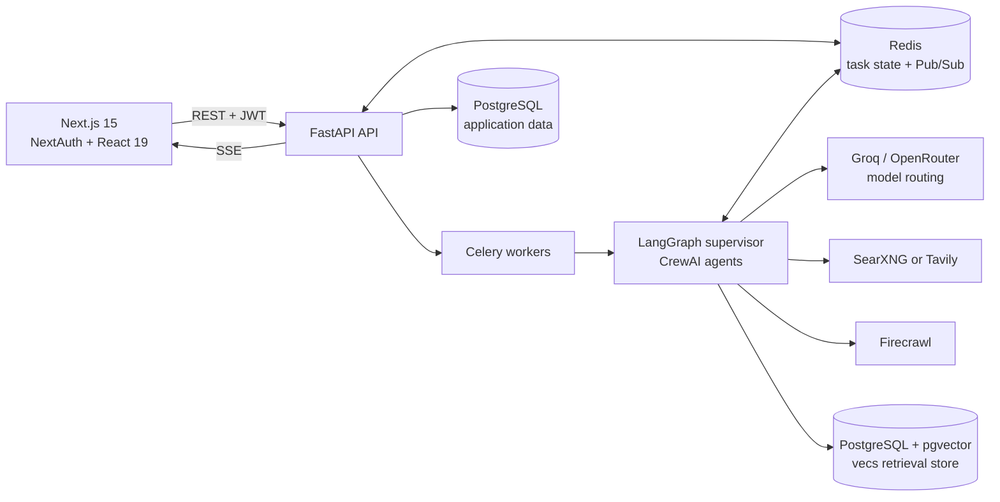

# Agentic Research Factory

[](https://github.com/befikadusata/agentic-research-factory/actions/workflows/ci.yml)
[](backend/pyproject.toml)
[](backend/main.py)
[](frontend/package.json)
[](docker-compose.yml)
[](frontend/e2e)
[](docker-compose.yml)
<br>
[](backend/agents/crew.py)
[](backend/agents/crew.py)
[](searxng/settings.yml)
[](backend/services/pdf_service.py)
[](docker-compose.yml)
[](backend/celery_app.py)

An AI-assisted market research platform that coordinates specialized agents, pauses for human review, and produces cited, export-ready briefs. It combines a stateful LangGraph workflow, hybrid retrieval, multi-tenant access control, and live Server-Sent Events (SSE) updates in a full-stack application.

## Product Walkthrough

From a structured competitor brief to agent execution, human review, and a cited deliverable:



<sub>The walkthrough was captured with Playwright using deterministic route-intercepted data. Live research runs depend on the configured model and search providers.</sub>

### Human-in-the-loop quality gate

The workflow pauses after research so an operator can inspect the evidence, redirect the analysis, or approve the next stage.



## Engineering Highlights

- **Resumable agent orchestration:** A LangGraph supervisor routes task-specific CrewAI agents. Each human approval boundary ends the current Celery segment, persists state, and resumes in a new task so an idle reviewer does not occupy a worker.
- **High-precision document retrieval:** Uploaded PDFs are parsed with Docling, with LlamaParse as an optional fallback. Queries fan out through multi-query retrieval, combine HNSW vector search with BM25 keyword search, and pass the merged candidates through an MS MARCO cross-encoder.
- **Real-time, failure-aware execution:** Redis Pub/Sub feeds SSE status and log events to the Next.js client. Provider routing, bounded retries, stuck-run recovery, and a configurable per-run cost ceiling keep failures and spend visible.
- **Tenant-aware authorization:** Workspaces isolate runs and uploaded documents. API routes enforce `viewer`, `operator`, and `admin` membership rules, including cross-user and cross-workspace denial paths.
- **Reviewable outputs:** Completed runs retain intermediate research and analysis, extracted citations, model-cost records, quality scores, and Markdown/PDF exports instead of exposing only the final model response.

## Architecture



The application database uses SQLAlchemy and Alembic. The current document-RAG path uses `vecs` and connects through `SUPABASE_DB_URL`; see the [architecture specification](docs/architecture.md) and [RAG notes](docs/optimizations.md) for implementation details.

## Core Capabilities

- Research playbooks for B2B lead intelligence, competitor analysis, and founder strategy
- Dynamic routing across Strategist, Researcher, Analyst, Reviewer, Writer, Editor, and Lead Intel roles
- Explicit research and analysis approval checkpoints
- Uploaded-document RAG scoped to workspaces and optional vertical tags
- Live pipeline status and agent-event streaming
- Reusable monitors for scheduled follow-up research
- Per-agent token and cost auditing
- Markdown and PDF exports

## Technology

| Layer | Implementation |
| :-- | :-- |
| Frontend | Next.js 15, React 19, NextAuth.js, Tailwind CSS, Playwright |
| API | FastAPI, Python 3.11+, Pydantic, SQLAlchemy, Alembic |
| Orchestration | LangGraph, CrewAI, Celery |
| Data | PostgreSQL, pgvector/vecs, Redis |
| Retrieval | Docling, optional LlamaParse fallback, SentenceTransformers, BM25 + HNSW |
| Operations | Docker Compose, structured logging, Prometheus metrics, optional Langfuse tracing |

## Quick Start

### Core live research

This path starts the web application, API, PostgreSQL, Redis, Celery workers, and self-hosted SearXNG. It does not start the heavier self-hosted Firecrawl stack or configure uploaded-document RAG.

Prerequisites: Docker with Compose and at least one supported LLM provider key. A Groq key is the simplest default.

1. Create the backend environment file:

   ```bash
   cp backend/.env.example backend/.env
   ```

2. In `backend/.env`, set `GROQ_API_KEY`. Leave unused provider keys and per-agent model overrides blank so capability-based routing selects the available Groq models.

   With the unchanged development Compose file, use its local-only auth values in the backend environment:

   ```dotenv
   BACKEND_JWT_SECRET=dummy-secret
   NEXTAUTH_SECRET=test-secret-at-least-32-chars-long-for-e2e
   ```

   For any shared or deployed environment, generate real secrets and update the corresponding frontend environment values at the same time.

   Google OAuth is optional for local use; the application also supports email/password registration. In development, the verification URL is returned to the client when SMTP is not configured.

3. Start the core stack:

   ```bash
   docker compose up --build
   ```

   Migrations run in the `migrate` init container before the API starts.

4. Open:

   | Service | URL |
   | :-- | :-- |
   | Frontend | http://localhost:3000 |
   | OpenAPI docs | http://localhost:8000/docs |
   | Health check | http://localhost:8000/health |

### Enable the full feature set

Add only the providers required for the features you want:

| Feature | Configuration |
| :-- | :-- |
| Cross-provider model fallback | `OPENROUTER_API_KEY` |
| Gemini document embeddings | `GEMINI_API_KEY` |
| Uploaded-document RAG | `SUPABASE_DB_URL` pointing to a PostgreSQL/pgvector database usable by `vecs` |
| Cloud search instead of SearXNG | `TAVILY_API_KEY` |
| Cloud scraping | `FIRECRAWL_API_KEY`; when using Compose, remove or override its self-hosted `FIRECRAWL_API_URL` value |
| LlamaParse PDF fallback | `LLAMA_CLOUD_API_KEY` |
| LLM tracing | `LANGFUSE_PUBLIC_KEY` and `LANGFUSE_SECRET_KEY` |

Self-hosted Firecrawl is an opt-in five-container profile:

```bash
docker compose --profile scraping up --build
```

Plain `docker compose up` starts SearXNG but intentionally skips Firecrawl. The backend continues with search snippets when scraping is unavailable.

For hosted environments and production configuration, see the [deployment guide](docs/deployment.md).

## Testing

The CI workflow runs backend tests with PostgreSQL and Redis, frontend linting, mocked Playwright end-to-end flows, and independent frontend/backend Docker builds.

As of 2026-07-23, the backend suite passes **285 tests across 32 test files**, covering:

- agent routing, retry behavior, HITL pause/resume, and stuck-run recovery
- authentication, workspace authorization, and cross-user access denial
- document ingestion, hybrid retrieval, citation extraction, and untrusted-content handling
- SSE/Redis signaling, analytics, cost tracking, monitors, and output formatting

Run the backend suite:

```bash
cd backend
uv run pytest
```

Run the route-intercepted frontend flows:

```bash
cd frontend
npm install --legacy-peer-deps
npx playwright install chromium
npx playwright test
```

The Playwright suite is deterministic and does not call the live backend or external model providers. Docker authentication end-to-end tests use `playwright.docker.config.ts` and require the Compose stack.

## Reliability and Known Boundaries

- Model and search output varies by provider, model version, and source availability.
- The displayed quality score is an LLM-as-judge assessment, not a guarantee of factual correctness; the human checkpoint and citations remain the primary review controls.
- Uploaded-document RAG currently uses a separate `vecs` connection configured by `SUPABASE_DB_URL`.
- Firecrawl is resource-intensive and therefore excluded from the default Compose profile.
- Search, scraping, parsing, and evaluation degrade independently where possible; model exhaustion and core database failure terminate a run.

See the [reliability guide](docs/reliability.md) for retry, timeout, health-check, and fallback behavior.

## Documentation

| Document | Purpose |
| :-- | :-- |
| [Architecture specification](docs/architecture.md) | Agent graph, retrieval flow, state transitions, and data model |
| [Deployment guide](docs/deployment.md) | Hosted and local deployment configuration |
| [Reliability guide](docs/reliability.md) | Failure modes, retries, timeouts, and observability |
| [RAG optimizations](docs/optimizations.md) | Query expansion, hybrid indexing, and reranking |
| [Demo readiness checklist](docs/checklists/demo_readiness.md) | Pre-demo verification steps |
