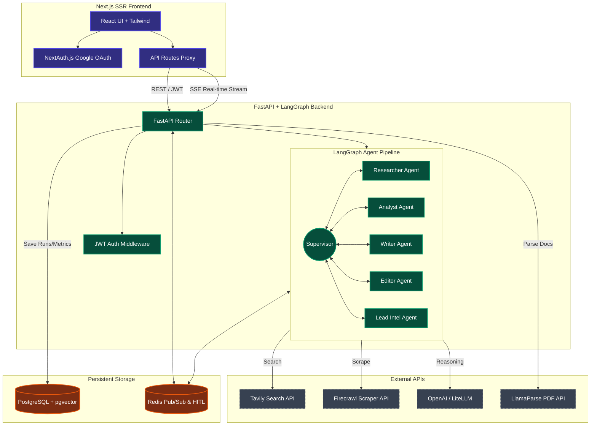

# System Architecture & Design Specification

This document details the architectural layers, agent relationships, retrieval mechanics, and database design of the **Agentic Research Factory**.

---

## 1. High-Level Architecture Diagram

The system operates as a three-tier web application integrated with external LLM models and scraping APIs. The frontend acts as a monitoring panel and input terminal, while the backend coordinates state transitions and runs the multi-agent graph.

---

## 2. Agent Coordination Loop (LangGraph Supervisor)

Instead of a linear sequential queue, the system utilizes a **Supervisor Routing Pattern** implemented in [backend/agents/crew.py](file:///home/befikadusata/Devs/2026/agentic-research-factory/backend/agents/crew.py). This architecture routes tasks dynamically based on the vertical and active run parameters:

### Agent Roles and Boundaries
1. **Supervisor**: Orchestrates which node should run next based on `task_type` (`research_report` vs. `lead_intel` vs. `quick_snapshot`).
2. **Strategist (Planner)**: Active in `research_report` runs. Formulates the core search goals and outlines research parameters.
3. **Researcher**: Uses Tavily and vector-retrieved document chunks to compile a raw list of cited evidence.
4. **Analyst**: Processes research evidence, structures it into thematic bullet points, and performs analytical synthesis.
5. **Reviewer**: Evaluates analysis outputs against a quality rubric. Returns a `PASS` or `FAIL` status. (A `FAIL` status triggers up to 3 research retries).
6. **Writer**: Transforms approved raw reports or snapshots into the requested formatting syntax (Executive Summary, Full Report, or LinkedIn article).
7. **Editor**: Reviews draft articles for grammar, stylistic polish, and formatting.
8. **Lead Intel Agent**: An isolated agent that runs solo for `lead_intel` tasks, focusing on web profiling and sales intelligence.

---

## 3. High-Precision Retrieval-Augmented Generation (RAG)

Documents uploaded via the UI `/upload` route are processed through a high-precision pipeline:

1. **Document Ingestion**:
   - PDFs are split into markdown pages using LlamaParse.
   - Text chunks are parsed with a `RecursiveCharacterTextSplitter` (size = 1000, overlap = 200) to preserve paragraph flow.
   - Embeddings are generated with `all-MiniLM-L6-v2` and saved in a PostgreSQL vector store.
2. **Hybrid Search**:
   - Queries are rewritten/expanded via a dedicated LLM rewriter ([query_rewriter.py](file:///home/befikadusata/Devs/2026/agentic-research-factory/backend/services/query_rewriter.py)).
   - Dual-index search query is dispatched using dense `HNSW` vectors alongside sparse `BM25` keyword indexes.
3. **Cross-Encoder Re-ranking**:
   - 20 candidate document chunks are retrieved from PostgreSQL.
   - Candidate chunks are re-scored using `cross-encoder/ms-marco-MiniLM-L-6-v2` to determine exact contextual relevance.
   - The top 5 chunks are returned to the requesting agent node.
4. **Scoping**:
   - Retrieval operations apply database-level `query_filters` based on workspace metadata tags.

---

## 4. Real-time Logging & Human-in-the-Loop (HITL) Signaling

1. **Agent State Events**: As CrewAI agents execute actions, their logs are routed via Redis channels under a `run_log:{run_id}` prefix.
2. **FastAPI Streaming**: The client opens an EventSource connection to the `/runs/{id}/stream` route. The SSE handler listens to Redis Pub/Sub events and flushes them to the browser.
3. **HITL Interrupt Loop**:
   - When a checkpoint is reached, the backend sets the run status to an awaiting state (e.g., `awaiting_research_approval`) and blocks on `blpop` or Redis key polling.
   - The client UI presents an interactive modal showing the current draft along with an instruction input field.
   - Approving the state posts user input to `/runs/{id}/approve`, which writes the instruction to `run_hitl_instr:{run_id}` and sets `run_hitl_signal:{run_id}` to release the backend block.
   - The agent resumes execution, reading the injected user feedback to refine the next lifecycle stage.

---

## 5. Database Schema

The database schemas defined in [backend/models.py](file:///home/befikadusata/Devs/2026/agentic-research-factory/backend/models.py) govern isolation and resource utilization:

* **Workspaces**: Group resources and establish isolation boundaries.
* **WorkspaceMembers**: Map users to workspaces and assign permissions (`viewer`, `operator`, `admin`).
* **Runs**: Record execution state, topic inputs, vertical config, documents ingested, and raw outputs (research, analysis, final).
* **RunCosts**: Log exact input/output tokens and cost calculations per model invocation.
