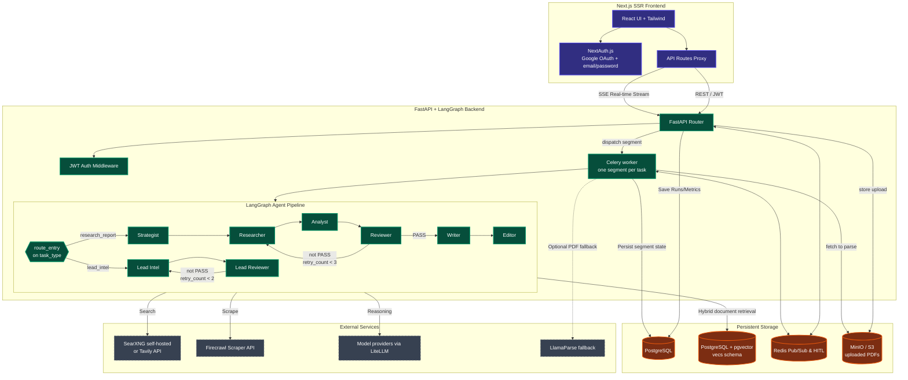

# System Architecture & Design Specification

This document details the architectural layers, agent relationships, retrieval mechanics, and database design of the **Agentic Research Factory**.

---

## 1. High-Level Architecture Diagram

The system operates as a three-tier web application integrated with external LLM models and scraping APIs. The frontend is a monitoring panel and input terminal. The API owns state transitions and dispatches one pipeline segment at a time to a Celery worker, which is where the agent graph actually executes.

```mermaid
graph TD
    %% Styling
    classDef frontend fill:#312e81,stroke:#4f46e5,stroke-width:2px,color:#fff
    classDef backend fill:#064e3b,stroke:#059669,stroke-width:2px,color:#fff
    classDef db fill:#7c2d12,stroke:#ea580c,stroke-width:2px,color:#fff
    classDef external fill:#374151,stroke:#6b7280,stroke-width:1px,color:#fff,stroke-dasharray: 5 5

    %% Frontend
    subgraph Frontend [Next.js SSR Frontend]
        UI[React UI + Tailwind]:::frontend
        Auth[NextAuth.js<br/>Google OAuth + email/password]:::frontend
        API_Route[API Routes Proxy]:::frontend
        UI --> Auth
        UI --> API_Route
    end

    %% Backend
    subgraph Backend [FastAPI + LangGraph Backend]
        API[FastAPI Router]:::backend
        Auth_MW[JWT Auth Middleware]:::backend
        Worker[Celery worker<br/>one segment per task]:::backend
        API --> Auth_MW

        subgraph Graph [LangGraph Agent Pipeline]
            Entry{{"route_entry<br/>on task_type"}}:::backend
            Plan[Strategist]:::backend
            Researcher[Researcher]:::backend
            Analyst[Analyst]:::backend
            Reviewer[Reviewer]:::backend
            Writer[Writer]:::backend
            Editor[Editor]:::backend
            LeadIntel[Lead Intel]:::backend
            LeadReviewer[Lead Reviewer]:::backend

            Entry -- "research_report" --> Plan
            Entry -- "lead_intel" --> LeadIntel

            Plan --> Researcher
            Researcher --> Analyst
            Analyst --> Reviewer
            Reviewer -- "PASS" --> Writer
            Reviewer -- "not PASS<br/>retry_count &lt; 3" --> Researcher
            Writer --> Editor

            LeadIntel --> LeadReviewer
            LeadReviewer -- "not PASS<br/>retry_count &lt; 2" --> LeadIntel
        end

        API -- "dispatch segment" --> Worker
        Worker --> Graph
    end

    %% Database
    subgraph Storage [Persistent Storage]
        PG[(PostgreSQL)]:::db
        VectorDB[(PostgreSQL + pgvector<br/>vecs schema)]:::db
        Redis[(Redis Pub/Sub & HITL)]:::db
        Files[(MinIO / S3<br/>uploaded PDFs)]:::db
    end

    %% External Services
    subgraph External [External Services]
        WebSearch[SearXNG self-hosted<br/>or Tavily API]:::external
        Firecrawl[Firecrawl Scraper API]:::external
        LLM[Model providers via LiteLLM]:::external
        LlamaParse[LlamaParse fallback]:::external
    end

    %% Connections
    API_Route -- "REST / JWT" --> API
    API_Route -- "SSE Real-time Stream" --> API

    Graph -- "Search" --> WebSearch
    Graph -- "Scrape" --> Firecrawl
    Graph -- "Reasoning" --> LLM
    Graph -- "Hybrid document retrieval" --> VectorDB
    Worker -. "Optional PDF fallback" .-> LlamaParse

    API -- "store upload" --> Files
    Worker -- "fetch to parse" --> Files
    API -- "Save Runs/Metrics" --> PG
    Worker -- "Persist segment state" --> PG
    API <--> Redis
    Worker <--> Redis
```

---

## 2. Agent Graph and Routing (LangGraph)

There is no supervisor *node* — the compiled graph is exported under the name `supervisor`, but routing is done by the conditional edge functions described below. `build_graph` in [`backend/agents/crew.py`](../backend/agents/crew.py) compiles two branches over one `ResearchState`. `route_entry` picks the branch from `task_type` at `START`:

| `task_type` | Branch |
| :-- | :-- |
| `research_report` | `plan → research → analyse → review → write → edit` |
| `lead_intel` | `lead_intel → lead_review` |

`route_entry` also honours `_resume_from`, which `run_service` sets when it re-enters the graph mid-pipeline in a fresh worker process (see §5).

Each node is a single-agent CrewAI kickoff, not a conversation between agents; the edges below are the only coordination.

### Agent Roles and Boundaries
1. **Strategist (Planner)**: `research_report` only. Formulates the core search goals and outlines research parameters. Its plan is compacted to 1,200 characters before being folded into the researcher's topic.
2. **Researcher**: Uses the `web_search` tool (self-hosted SearXNG when `SEARXNG_URL` is set, otherwise Tavily) and vector-retrieved document chunks to compile a raw list of cited evidence. Its iteration and token budget escalates on each retry.
3. **Analyst**: Processes research evidence, structures it into thematic bullet points, and performs analytical synthesis.
4. **Reviewer**: Scores the research plus analysis against the vertical's `quality_rubric` and emits a machine-readable `VERDICT: PASS|FAIL` line. `route_after_review` sends `PASS` to the writer; anything else (including an unparseable verdict) loops back to `research` while `retry_count` is under 3 **and** the run is under `RUN_COST_CEILING_USD`, and otherwise ships what exists.
5. **Writer**: Turns the approved analysis into the requested output format — `report`, `linkedin`, or `summary`. When the topic carries a `**Required Output Sections**` block from the vertical, the writer prompt adds the section contract.
6. **Editor**: Reviews the draft for grammar, stylistic polish, and formatting, and re-emits the full deliverable.
7. **Lead Intel Agent**: `lead_intel` only. Web profiling and sales intelligence in one node, with no strategist, analyst, writer, or editor stage.
8. **Lead Reviewer**: Reuses the reviewer agent over the lead-intel dossier, then prepends the results of `lead_intel_contract_failures` — deterministic checks for the required sections, a sourced and dated buyer claim, and the requested target role. Those checks force `VERDICT: FAIL` regardless of what the LLM concluded. `route_after_lead_review` loops back to `lead_intel` while `retry_count` is under 2 and the run is under budget.

### Adding a playbook

Playbooks (verticals) are data, not code paths. A new one is an entry in the `VERTICALS` registry in [`backend/configs/verticals.py`](../backend/configs/verticals.py); no agent, router, or graph change is required.

The `VerticalConfig` shape in that file is the contract. Each key has its own consumer:

| Key | Consumed by |
| :-- | :-- |
| `input_schema` | Renders the form fields on `/new`, and is validated on submission by `validate_vertical_inputs` in [`schemas.py`](../backend/schemas.py) (required fields, `url` scheme, `select` options). |
| `prompt_focus` | Emitted as **Research Focus** in the execution brief that `build_execution_brief` composes. |
| `output_sections` | Emitted as **Required Output Sections** in the same brief. The writer and editor detect that literal header in their topic and switch on an extra section-contract block in their prompts. |
| `quality_rubric` | Handed to the reviewer node — `node_review` for `research_report`, `node_lead_review` for `lead_intel`. Nothing else reads it; the evaluation harnesses in §4 do not. |
| `task_type` | Read by `run_service` when it seeds the state, then by `route_entry` to pick the branch. |
| `default_format` | The output format the `/new` form preselects. |
| `display_name`, `description`, `icon` | Served over `/verticals` for the UI. |
| `metric_keys` | Declared per vertical, but nothing in the repo reads it. |

The execution brief becomes the run's `topic`, so `prompt_focus` and `output_sections` reach *every* node, not only the ones that act on them.

The frontend reads the registry over `/verticals` rather than duplicating it, so a playbook added server-side appears in the UI without a frontend release. Its badge falls back to a neutral accent until `frontend/lib/types.ts` gains a palette entry for the key; that bundled copy is also the fallback for when the `/verticals` request cannot be answered.

---

## 3. High-Precision Retrieval-Augmented Generation (RAG)

Documents posted to the `/upload` API route are processed through a high-precision pipeline:

1. **Document Ingestion**:
   - The uploaded PDF is stored through [`storage_service.py`](../backend/services/storage_service.py) and the resulting locator recorded on the document row ([`upload.py`](../backend/routers/upload.py)). Parsing is asynchronous — the API returns `pending` and a Celery task fetches the bytes back later — so the store has to be reachable from *both* processes, which under Compose are separate containers. `STORAGE_BACKEND=s3` puts them in an S3-compatible bucket (MinIO locally) that both reach over the network; `local` writes to `UPLOAD_DIR` and is correct only when the API and the worker share a filesystem.
   - An object the worker cannot fetch raises `ObjectNotFound`, which is reported as a storage fault ahead of the generic parser message. Without that distinction the failure surfaces as "no extractable text", blaming the user's PDF for a misconfigured store.
   - Objects are **not** deleted after ingestion, so a document can be re-parsed without re-uploading. Nothing prunes them. The copy staged on the worker's local disk for the parse *is* deleted once the parse returns, so worker disk does not grow per ingest.
   - PDFs are converted to Markdown with Docling. LlamaParse is an optional fallback when Docling fails and `LLAMA_CLOUD_API_KEY` is configured.
   - Each page is exported and split separately with a `RecursiveCharacterTextSplitter` (size = 1000, overlap = 200), so every chunk carries the page it came from and citations can name a real page. A chunk therefore never straddles a page break; documents with no page provenance fall back to a whole-document split with no page number.
   - Every chunk also carries an `ordinal`, its position within its own document, assigned in `ingest_documents` so all parsers get it identically. It is what neighbour expansion navigates by (§3.4). Chunks ingested before it existed have none and are never expanded.
   - Embeddings use the configured Gemini embedding model when a Gemini key is present; otherwise they use the local `all-MiniLM-L6-v2` model. The choice is made by config alone and never by runtime success — a per-call fallback would put vectors from two models in one collection, where they are no longer comparable. Vectors are stored in workspace-scoped `vecs` collections — tables in the `vecs` schema of the PostgreSQL instance named by `VECTOR_DB_URL`, which defaults to the application database.
   - Gemini embedding is batched at the API's 100-text ceiling rather than one request per chunk (6.9× faster on measured ingest), and vectors are cached in Redis keyed on provider + model + dimension + text, so repeated queries and re-ingested documents cost a local lookup instead of a round trip. The cache never raises; a Redis failure is indistinguishable from a miss.
2. **Hybrid Search**:
   - Queries are expanded into semantically distinct sub-queries by an LLM ([`query_rewriter.py`](../backend/services/query_rewriter.py)), falling back to the original query on any failure.
   - Each sub-query is dispatched twice: against the dense `HNSW` vector index, and against a GIN full-text index (`ts_rank_cd`) for exact-term recall. Results merge into one deduplicated pool.
   - The full-text half matches **any** query term rather than all of them, via `websearch_to_tsquery` over `or`-joined terms, which also keeps hyphenated identifiers (`ACM-429`) as phrases. `plainto_tsquery` would AND the lexemes instead, and a question-shaped query then matches nothing — leaving the pool as the vector half's results alone, with no error to show for it.
3. **Cross-Encoder Re-ranking**:
   - Up to 10 candidates per sub-query per retrieval half are pulled from PostgreSQL and deduplicated by chunk ID.
   - Candidates are re-scored using `cross-encoder/ms-marco-MiniLM-L-6-v2` to determine exact contextual relevance. [`tools.rag.retrieve`](../backend/tools/rag.py) returns the whole ranked pool; the gate and the top-5 cut are applied by `RAGTool._run` above it, so the evaluation harness can measure the ranking rather than the truncation.
   - If the pool's **best** score falls below `RAG_MIN_RERANK_SCORE`, retrieval abstains and tells the agent to use `web_search` instead; otherwise the top 5 chunks go to the requesting agent node. The recall-first pool is almost never empty, so without this gate a question the documents never address still returns citable-looking excerpts.
   - The gate is pool-level and deliberately narrow. This model's absolute scores separate *"the corpus isn't about this"* but **not** *"answers the question"* from *"same topic, doesn't"* — those ranges overlap almost entirely, in both the pair-level calibration and the pipeline eval. A per-chunk filter would therefore drop relevant chunks that happen to score low while keeping their neighbours. Ordering, not thresholding, is what selects among chunks that clear the gate.
   - The default of `−9.0` is measured against the pipeline, not against pairs — the distinction that decided the number. See §4.
4. **Context Assembly**:
   - The surviving chunks are widened by `RAG_NEIGHBOUR_RADIUS` chunks either side before the agent sees them ([`tools.rag.expand_context`](../backend/tools/rag.py)). Retrieval ranks 1000-character windows because that is what the embedder and re-ranker read in full, but a window is not a unit of meaning — the chunk that names a limit and the sentence qualifying it are one paragraph and two chunks apart.
   - Neighbours are fetched by `(source, ordinal)` in a single query, backed by a B-tree over both expressions. Expansion never crosses a page boundary, so every block carries one exact page citation.
   - Contiguous chunks are merged into one block and stitched with their overlap removed, so a passage reads once rather than repeating a paragraph at every seam.
   - Failure is never fatal: a missing ordinal, a radius of 0, or a lookup that raises all return the results unexpanded. Only the neighbours are budgeted (`_MAX_CONTEXT_CHUNKS`), so the retrieved chunks themselves are never dropped.
5. **Scoping**:
   - Each workspace uses its own collection, with optional metadata filtering by research vertical.

---

## 4. Retrieval Evaluation

Three instruments, all opt-in behind `RUN_MODEL_EVALS=1` because they load real models. The third, [`evals/retrieval_baselines.py`](../backend/evals/retrieval_baselines.py), is not a harness but a set of ablations — naive dense top-k and dense + re-ranking — that the pipeline is measured against via `--compare`. The other two:

| | [`evals/rerank_calibration.py`](../backend/evals/rerank_calibration.py) | [`evals/retrieval_eval.py`](../backend/evals/retrieval_eval.py) |
|---|---|---|
| Input | 34 labelled `(query, passage)` pairs | 54-chunk corpus, 62 golden + 10 unanswerable queries |
| Runs retrieval? | No | Yes — real ingest, real `retrieve()` |
| Answers | where the model puts a *given* pair | whether the pipeline *finds* the right chunk |
| Reports | score distribution by label, threshold sweep | hit@{1,3,5,10}, MRR, NDCG@k, pool recall, coverage, abstention rates |

`pool recall` — the relevant chunk being anywhere in the candidate pool — is reported separately from `hit@k` because it localises a failure. A miss with the chunk in the pool is a re-ranking problem; a miss with the chunk absent is a recall problem that no re-ranker change can fix.

`coverage` is reported twice, over the ranking and over what neighbour expansion delivers, because they are different questions. hit@k asks whether retrieval found *an* answering chunk; coverage asks what fraction of them arrived, which is what a multi-chunk query needs and what §3.4 is meant to move.

The two disagree about the threshold, and the disagreement is the finding. Calibration puts off-topic pairs near −11.2, which makes −11.0 look correct; against the real pipeline that value rejects 1 of 10 unanswerable queries. The gate never scores an isolated passage — it scores the best chunk retrieval found in the whole corpus, which runs far higher. The threshold is therefore set from the pipeline measurement, and `tests/test_rerank_calibration.py` keeps the discrepancy executable so the pair-level number cannot be re-adopted on the strength of how carefully it was measured.

The ablation reports one result worth knowing before reading any of the others: on this 54-chunk corpus, **naive dense top-k outranks the full pipeline** (hit@5 0.984 against 0.903), because dense recall is already perfect at this scale and every stage above it can only add distractors. What production wins is the abstention gate, which dense has no scale to implement and which stops all ten unanswerable queries from returning citable-looking excerpts. The fan-out is justified by an untested expectation that dense recall degrades on larger corpora, not by a measurement. `docs/optimizations.md` carries the numbers and the argument.

These are regression guards rather than leaderboards, so the assertions in `tests/test_retrieval_eval.py` sit deliberately below the measured numbers: they should fire when retrieval breaks and stay quiet when a dependency bump moves a metric by a point. The ablation assertion is on the *gap* to the baseline for the same reason — it fires if the pipeline drifts further behind, not if it improves.

---

## 5. Real-time Logging & Human-in-the-Loop (HITL) Signaling

1. **Agent State Events**: As CrewAI agents execute actions, their logs are routed via Redis channels under a `run_log:{run_id}` prefix.
2. **FastAPI Streaming**: The client opens an EventSource connection to the `/runs/{id}/stream` route. The SSE handler listens to Redis Pub/Sub events and flushes them to the browser.
3. **HITL Interrupt Loop**:
   - The run is split into four Celery tasks — start (plan + research, or a lead-intel pass), analyse (analyse + review), write (write + edit), and finalize — with a gate between each. At a gate the backend persists the output, sets the matching awaiting status (`awaiting_research_approval`, `awaiting_analysis_approval`, or `awaiting_final_approval`), and returns the worker slot.
   - The graph's own pauses come from `interrupt_before=["analyse", "write"]` on the compiled graph. A run resumed in a fresh worker process cannot use the in-memory checkpoint, so `run_service` rebuilds the state from the database and sets `_resume_from` to re-enter at the right node.
   - The client UI presents an interactive modal showing the current draft along with an instruction input field.
   - Approving the state posts user input to `/runs/{id}/approve`, stores the instruction in Redis, and dispatches the next segment.
   - The next task claims the expected gate atomically, reads the feedback, and resumes from persisted state. Duplicate or stale approvals become no-ops.

---

## 6. Database Schema

The tables defined in [`backend/models.py`](../backend/models.py), migrated by Alembic:

* **Users**: Credential store for the email/password provider only. Identity across the app is the email string, and Google users never get a row here.
* **Workspaces**: Group resources and establish isolation boundaries.
* **WorkspaceMembers**: Map users to workspaces and assign permissions (`viewer`, `operator`, `admin`).
* **Documents**: One uploaded PDF — its storage locator, ingestion status, chunk count, and optional vertical tag. Workspace-scoped.
* **Runs**: Record execution state (`RunStatus`, including the three awaiting-approval gates), topic inputs, vertical config, `doc_paths`, raw outputs (research, analysis, final), logs, and a `metrics` JSON blob carrying latency, eval scores, and citations.
* **RunCosts**: Log exact input/output tokens and cost calculations per model invocation.
* **Monitors**: A saved run template plus a cadence. Celery-beat spawns a fresh Run with `Run.monitor_id` set each time one is due. No ORM relationship is declared to Runs — there are two FK paths between the tables, so services query the columns directly.
