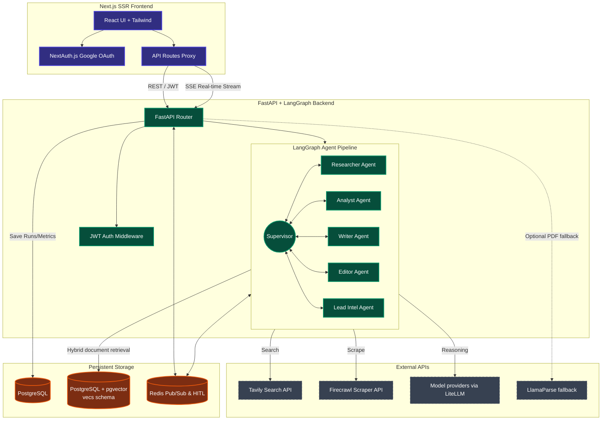

# System Architecture & Design Specification

This document details the architectural layers, agent relationships, retrieval mechanics, and database design of the **Agentic Research Factory**.

---

## 1. High-Level Architecture Diagram

The system operates as a three-tier web application integrated with external LLM models and scraping APIs. The frontend acts as a monitoring panel and input terminal, while the backend coordinates state transitions and runs the multi-agent graph.

```mermaid
graph TD
    %% Styling
    classDef frontend fill:#312e81,stroke:#4f46e5,stroke-width:2px,color:#fff
    classDef backend fill:#064e3b,stroke:#059669,stroke-width:2px,color:#fff
    classDef db fill:#7c2d12,stroke:#ea580c,stroke-width:2px,color:#fff
    classDef external fill:#374151,stroke:#6b7280,stroke-width:1px,color:#fff,stroke-dasharray: 5 5

    %% Frontend
    subgraph Frontend [Next.js SSR Frontend]
        UI[React UI + Tailwind]:::frontend
        Auth[NextAuth.js Google OAuth]:::frontend
        API_Route[API Routes Proxy]:::frontend
        UI --> Auth
        UI --> API_Route
    end

    %% Backend
    subgraph Backend [FastAPI + LangGraph Backend]
        API[FastAPI Router]:::backend
        Auth_MW[JWT Auth Middleware]:::backend
        API --> Auth_MW
        
        subgraph Graph [LangGraph Agent Pipeline]
            Supervisor((Supervisor)):::backend
            Researcher[Researcher Agent]:::backend
            Analyst[Analyst Agent]:::backend
            Writer[Writer Agent]:::backend
            Editor[Editor Agent]:::backend
            LeadIntel[Lead Intel Agent]:::backend
            
            Supervisor <--> Researcher
            Supervisor <--> Analyst
            Supervisor <--> Writer
            Supervisor <--> Editor
            Supervisor <--> LeadIntel
        end
        
        API --> Graph
    end

    %% Database
    subgraph Storage [Persistent Storage]
        PG[(PostgreSQL)]:::db
        VectorDB[(PostgreSQL + pgvector<br/>vecs schema)]:::db
        Redis[(Redis Pub/Sub & HITL)]:::db
    end

    %% External Services
    subgraph External [External APIs]
        Tavily[Tavily Search API]:::external
        Firecrawl[Firecrawl Scraper API]:::external
        LLM[Model providers via LiteLLM]:::external
        LlamaParse[LlamaParse fallback]:::external
    end

    %% Connections
    API_Route -- "REST / JWT" --> API
    API_Route -- "SSE Real-time Stream" --> API
    
    Graph -- "Search" --> Tavily
    Graph -- "Scrape" --> Firecrawl
    Graph -- "Reasoning" --> LLM
    API -. "Optional PDF fallback" .-> LlamaParse
    Graph -- "Hybrid document retrieval" --> VectorDB
    
    API -- "Save Runs/Metrics" --> PG
    API <--> Redis
    Graph <--> Redis
```

---

## 2. Agent Coordination Loop (LangGraph Supervisor)

Instead of a linear sequential queue, the system utilizes a **Supervisor Routing Pattern** implemented in [`backend/agents/crew.py`](../backend/agents/crew.py). This architecture routes tasks dynamically based on the vertical and active run parameters:

### Agent Roles and Boundaries
1. **Supervisor**: Orchestrates which node should run next based on `task_type` (`research_report` vs. `lead_intel` vs. `quick_snapshot`).
2. **Strategist (Planner)**: Active in `research_report` runs. Formulates the core search goals and outlines research parameters.
3. **Researcher**: Uses Tavily and vector-retrieved document chunks to compile a raw list of cited evidence.
4. **Analyst**: Processes research evidence, structures it into thematic bullet points, and performs analytical synthesis.
5. **Reviewer**: Evaluates analysis outputs against a quality rubric. Returns a `PASS` or `FAIL` status. (A `FAIL` status triggers up to 3 research retries).
6. **Writer**: Transforms approved raw reports or snapshots into the requested formatting syntax (Executive Summary, Full Report, or LinkedIn article).
7. **Editor**: Reviews draft articles for grammar, stylistic polish, and formatting.
8. **Lead Intel Agent**: An isolated agent that runs solo for `lead_intel` tasks, focusing on web profiling and sales intelligence.

---

## 3. High-Precision Retrieval-Augmented Generation (RAG)

Documents uploaded via the UI `/upload` route are processed through a high-precision pipeline:

1. **Document Ingestion**:
   - PDFs are converted to Markdown with Docling. LlamaParse is an optional fallback when Docling fails and `LLAMA_CLOUD_API_KEY` is configured.
   - Each page is exported and split separately with a `RecursiveCharacterTextSplitter` (size = 1000, overlap = 200), so every chunk carries the page it came from and citations can name a real page. A chunk therefore never straddles a page break; documents with no page provenance fall back to a whole-document split with no page number.
   - Embeddings use the configured Gemini embedding model when a Gemini key is present; otherwise they use the local `all-MiniLM-L6-v2` model. The choice is made by config alone and never by runtime success — a per-call fallback would put vectors from two models in one collection, where they are no longer comparable. Vectors are stored in workspace-scoped `vecs` collections — tables in the `vecs` schema of the PostgreSQL instance named by `VECTOR_DB_URL`, which defaults to the application database.
   - Gemini embedding is batched at the API's 100-text ceiling rather than one request per chunk (6.9× faster on measured ingest), and vectors are cached in Redis keyed on provider + model + dimension + text, so repeated queries and re-ingested documents cost a local lookup instead of a round trip. The cache never raises; a Redis failure is indistinguishable from a miss.
2. **Hybrid Search**:
   - Queries are expanded into semantically distinct sub-queries by an LLM ([`query_rewriter.py`](../backend/services/query_rewriter.py)), falling back to the original query on any failure.
   - Each sub-query is dispatched twice: against the dense `HNSW` vector index, and against a GIN full-text index (`ts_rank_cd`) for exact-term recall. Results merge into one deduplicated pool.
   - The full-text half matches **any** query term rather than all of them. `plainto_tsquery` ANDs its lexemes, which made the lexical half return nothing for question-shaped queries — the pool was the vector half's results alone, silently, for every query. `websearch_to_tsquery` over `or`-joined terms restores disjunction and keeps hyphenated identifiers (`ACM-429`) as phrases.
3. **Cross-Encoder Re-ranking**:
   - Up to 10 candidates per sub-query per retrieval half are pulled from PostgreSQL and deduplicated by chunk ID.
   - Candidates are re-scored using `cross-encoder/ms-marco-MiniLM-L-6-v2` to determine exact contextual relevance. [`tools.rag.retrieve`](../backend/tools/rag.py) returns the whole ranked pool; the gate and the top-5 cut are applied by `RAGTool._run` above it, so the evaluation harness can measure the ranking rather than the truncation.
   - If the pool's **best** score falls below `RAG_MIN_RERANK_SCORE`, retrieval abstains and tells the agent to use `web_search` instead; otherwise the top 5 chunks go to the requesting agent node. The recall-first pool is almost never empty, so without this gate a question the documents never address still yielded citable-looking excerpts.
   - The gate is pool-level and deliberately narrow. This model's absolute scores separate *"the corpus isn't about this"* but **not** *"answers the question"* from *"same topic, doesn't"* — those ranges overlap almost entirely, in both the pair-level calibration and the pipeline eval. A per-chunk filter would therefore drop relevant chunks that happen to score low while keeping their neighbours. Ordering, not thresholding, is what selects among chunks that clear the gate.
   - The default of `−9.0` is measured against the pipeline, not against pairs — the distinction that decided the number. See §4.
4. **Scoping**:
   - Each workspace uses its own collection, with optional metadata filtering by research vertical.

---

## 4. Retrieval Evaluation

Two harnesses, both opt-in behind `RUN_MODEL_EVALS=1` because they load real models:

| | [`evals/rerank_calibration.py`](../backend/evals/rerank_calibration.py) | [`evals/retrieval_eval.py`](../backend/evals/retrieval_eval.py) |
|---|---|---|
| Input | 34 labelled `(query, passage)` pairs | 54-chunk corpus, 62 golden + 10 unanswerable queries |
| Runs retrieval? | No | Yes — real ingest, real `retrieve()` |
| Answers | where the model puts a *given* pair | whether the pipeline *finds* the right chunk |
| Reports | score distribution by label, threshold sweep | hit@{1,3,5,10}, MRR, NDCG@k, pool recall, abstention rates |

`pool recall` — the relevant chunk being anywhere in the candidate pool — is reported separately from `hit@k` because it localises a failure. A miss with the chunk in the pool is a re-ranking problem; a miss with the chunk absent is a recall problem that no re-ranker change can fix.

The two disagreed about the threshold, and the disagreement was the finding. Calibration put off-topic pairs near −11.2, so −11.0 looked correct; against the real pipeline it rejected 1 of 10 unanswerable queries. The gate never scores an isolated passage — it scores the best chunk retrieval found in the whole corpus, which runs far higher. The threshold is now set from the pipeline measurement, and `tests/test_rerank_calibration.py` keeps the discrepancy executable so the pair-level number cannot be re-adopted on the strength of how carefully it was measured.

Both are regression guards rather than leaderboards, so the assertions in `tests/test_retrieval_eval.py` sit deliberately below the measured numbers: they should fire when retrieval breaks and stay quiet when a dependency bump moves a metric by a point.

---

## 5. Real-time Logging & Human-in-the-Loop (HITL) Signaling

1. **Agent State Events**: As CrewAI agents execute actions, their logs are routed via Redis channels under a `run_log:{run_id}` prefix.
2. **FastAPI Streaming**: The client opens an EventSource connection to the `/runs/{id}/stream` route. The SSE handler listens to Redis Pub/Sub events and flushes them to the browser.
3. **HITL Interrupt Loop**:
   - Each research, analysis, and writing segment runs as a separate Celery task. At a checkpoint, the backend persists the output, sets an awaiting status (for example, `awaiting_research_approval`), and returns the worker slot.
   - The client UI presents an interactive modal showing the current draft along with an instruction input field.
   - Approving the state posts user input to `/runs/{id}/approve`, stores the instruction in Redis, and dispatches the next segment.
   - The next task claims the expected gate atomically, reads the feedback, and resumes from persisted state. Duplicate or stale approvals become no-ops.

---

## 6. Database Schema

The database schemas defined in [`backend/models.py`](../backend/models.py) govern isolation and resource utilization:

* **Workspaces**: Group resources and establish isolation boundaries.
* **WorkspaceMembers**: Map users to workspaces and assign permissions (`viewer`, `operator`, `admin`).
* **Runs**: Record execution state, topic inputs, vertical config, documents ingested, and raw outputs (research, analysis, final).
* **RunCosts**: Log exact input/output tokens and cost calculations per model invocation.
